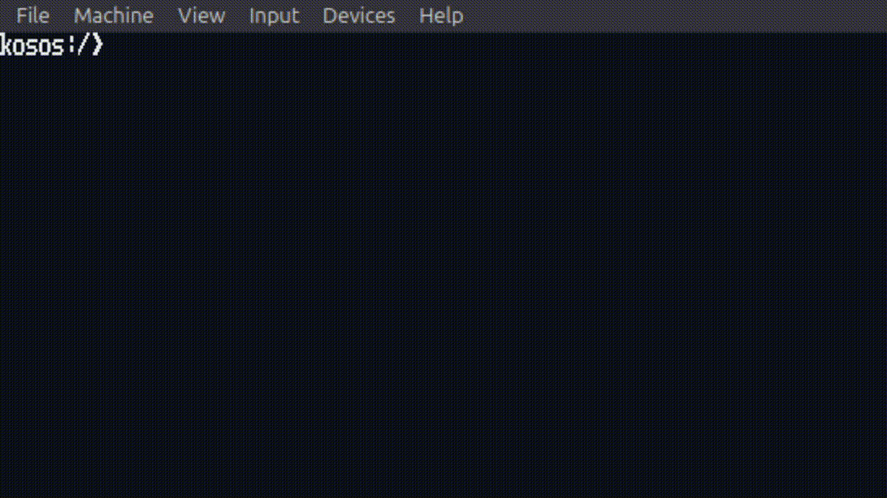

<h1 align="center">Kosos</h1>

<p align="center"><i>Kosos or Kinda Okayish &amp; Sluggish Operating System</i></p>

<p align="center">
	Kosos is a small hobby OS made completely from scratch, it can read/write fules using a FAT-like filesystem layout.
	It can do some basic maths and has its own set of commands for the kosos console.
	You can create files and write into them using a basic file editor.
	The KOSOS kernel is entirely made from scratch so this OS needs custom drivers for every other stuff and I'm still tryna figure out a lot of stuff :)
</p>

<p align="center">
	
</p>


## Build

```bash
make
```

## Build a bootable image

```bash
make iso
```

The ISO will be written to `build/kosos.iso`.

## Create a persistent disk image

```bash
make disk
```

This creates `build/kosos-disk.img` (16 MB raw IDE disk).

## Run in QEMU

```bash
make run
```

## Flashing & Running in VirtualBox

To test Kosos in VirtualBox or to write the ISO to a USB stick for real-hardware testing, follow these steps.

- Run the ISO directly in VirtualBox:

```bash
# Create a new VM (Linux/Other 64-bit) and set the CD/DVD to use build/kosos.iso
# Recommended: EFI off, enable IO APIC, 1-2 CPUs, 512MB-1GB RAM
# Boot the VM and Kosos will start from the ISO
```

- Write the ISO to a USB drive (careful: this will erase the drive). Replace `/dev/sdX` with your device:

```bash
sudo dd if=build/kosos.iso of=/dev/sdX bs=4M status=progress && sync
```

- In VirtualBox you can also attach the USB drive to the VM (use the VirtualBox USB passthrough) and boot from it. Alternatively, configure the VM to boot from the virtual CD using the ISO file.


